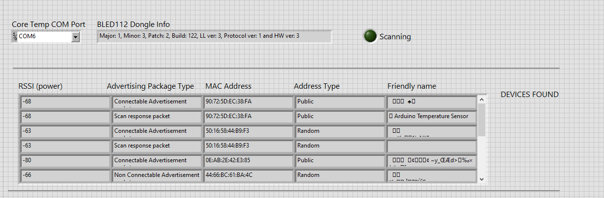

# Automated Temperature Tester PMDC

## Overview
The Automated Temperature Tester PMDC project utilizes an Arduino Nano 33 BLE, a K-Type Thermocouple, a Max6675 Breakout Board, a slip ring, and 3D printed fixtures. This document serves as a comprehensive guide for assembly, wiring, and usage of the automated temperature test LabVIEW program.

## Components
- Arduino Nano 33 BLE
- K-Type Thermocouple
- Max6675 Breakout Board (https://a.co/d/3DE7FEz)
- Slip Ring (https://www.digikey.com/short/75tw2fn4)
- BLED112 USB Dongle (https://www.digikey.com/short/ch5m7prf)
- Customized Shims for Bearing
- Customized Endbell for Different Frame Size
- 3D Printed Fixtures
- External 5V power supply

## Description
This automated tester device serves as a transmitter that sends temperature data through the air using Bluetooth Low Energy module to the host LabVIEW program (Eng lab computer/Desktop/Automated Temp Test/PM Automated Temperature Test Final).

## Wiring Diagram

## Installation and Setup
1. Assemble the components according to the diagram and assembly print (reference X-20604 for assembly prints). View the Assembly Documentation PDF for more detailed information on assembly.
2. Upload the Arduino sketch to the Arduino Nano 33 BLE.
3. Attach the thermocouple to the armature winding.
4. Feed the thermocouple through the bearing and attach the yellow to positive + and red to negative - on the breakout board.
5. Attach the device at the end of the modular shaft.

[Assembly Documentation.pdf](https://github.com/user-attachments/files/21864532/Assembly.Documentation.pdf)

## Usage
1. Start by adjusting the PID for the brake.
2. Select the correct model for the brake and send the configuration.
3. Enter the correct addresses for each device (see below) and check all physical connections.
4. Set the power supply to the correct voltage and run the motor.
5. Turn on the brake fan.
6. Hit the Start button to start the program.

**The device needs to be restarted when starting a new test.**

Note: The MAC address for the Arduino board varies. The default MAC address for the prototype device is 90:72:5D:EC:38:FA.
For other devices that use a new Arduino board, find the MAC address using the LabVIEW subvi located at Eng lab computer/This PC/Desktop/ble_read_temperature.vi

Choose the correct COM port which BLED112 USB Dongle is located.
Start the VI and capture the Mac Address for the device named as Arduino Temperature Sensor, copy and paste the MAC address to the main program.
## Troubleshooting
If you encounter any issues during setup or usage, refer to the following troubleshooting steps:
- Try restart the power analyser, power supply and brake controller by turning them off and back on.
- Restart the computer and check the connections of GPIB to USB cable.
- Restart the device by shutting off the external power supply.

## Conclusion
When test is complete save the raw data under H:\Eng\ENGINEERS\Tong\Class F Catolog Tem Test Data\RawData and process the data using the Excel Macro-Enabled Worksheet located under H:\Eng\ENGINEERS\Tong\ PM Automated Temperature Test Form by copying raw data to sheet2.

